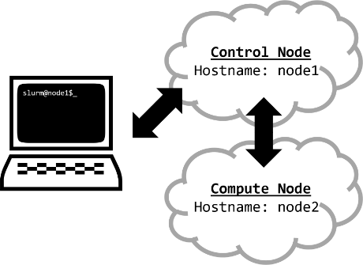
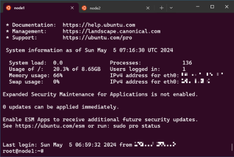

# [atet](https://github.com/atet) / [**_slurm_**](https://github.com/atet/slurm/blob/main/README.md#atet--slurm)

[](#nolink)

# **S**imple **L**inux **U**tility for **R**esource **M**anagement

Slurm is one of the most popular workload schedulers for high-performance computing. If you manage servers on-premises and/or in the cloud and have a bunch of folks fighting for resources, this tutorial is for you!

You will be able to get through this tutorial in about 10 minutes using cloud resources and the latest Ubuntu (24.04 LTS) and Slurm (23.11.4) as of May 4, 2024.

----------------------------------------------------------------------------

## Table of Contents

* [0. Requirements](#0-requirements)
* [1. Introduction](#1-introduction)
* [2. Installation](#2-installation)
* [3. Basic Examples](#3-basic-examples)
* [4. Next Steps](#4-next-steps)
* [5. Acknowledgements](#5-acknowledgements)

### Supplemental

* [Other Resources](#other-resources)
* [Troubleshooting](#troubleshooting)

----------------------------------------------------------------------------

## 0. Requirements

You will need to provision two cloud instances with a minimum of 1 vCPU and 512 MB of RAM each; we will be using the hostnames of `node1` for the control node and `node2` for the compute node.

This tutorial was made using Windows Subsystem for Linux (Ubuntu) on local computer and Ubuntu 24.04 LTS on cloud resources.

[Back to Top](#table-of-contents)

----------------------------------------------------------------------------

## 1. Introduction

The goal is to stand up a bare-minimum Slurm cluster with one control node and one compute node. You will access the cloud instances and perform all the installations, setup, and testing remotely:

[](#nolink)

Since we will be switching back and forth between accessing the two different nodes, it may be helpful to use something like Microsoft Terminal with different tabs:

[](#nolink)

[Back to Top](#table-of-contents)

----------------------------------------------------------------------------

## 2. Installation

2.1. Provision two cloud instances with minimum of 1 vCPU and 512 MB of RAM with the hostnames of `node1` and `node2`; take note of both the public IP addresses for these nodes

2.2 Log onto **both nodes** and for `node1` and `node2`, create a new user "`slurm`" with sudoer privileges, and change user to `slurm`:

```bash
# adduser slurm
<PROVIDE SIMPLE PASSWORD>
# adduser slurm sudo
# su - slurm
```

2.3. Share each node's IP address so they can refer to each other by hostname instead of IP address:

```bash
$ sudo nano /etc/hosts

<COPY AND PASTE IP ADDRESS AND HOSTNAME>
```

2.4. Update and upgrade software packages, install OpenMPI, create SSH keypairs, and take note of the node's public SSH key:

```bash
$ sudo apt update && \
  sudo apt -y upgrade && \
  sudo apt -y install openmpi-bin && \
  ssh-keygen -q -t rsa -b 4096 -N '' -f ~/.ssh/id_rsa && \
  cat ~/.ssh/id_rsa.pub
```

2.5. Share each node's public SSH key with each other

```bash
$ nano ~/.ssh/authorized_keys

<COPY AND PASTE PUBLIC SSH KEYS>
```

2.6. On the control node, `node1`, install mailutils (need to interact with GUI), Network File System (NFS), setup NFS, and setup a shared directory between the nodes:

```bash
$ sudo apt -y install mailutils nfs-kernel-server && \
  sudo mkdir /shared && \
  sudo chown nobody:nogroup -R /shared && \
  sudo chmod 777 -R /shared && \
  sudo sh -c 'echo "/shared *(rw,sync,no_root_squash,no_subtree_check)" >> /etc/exports' && \
  sudo exportfs -a && \
  service nfs-kernel-server status && \
  touch /shared/test_nfs && \
  ll /shared
```

2.7. On the compute node, `node2`, install the NFS client, ensuring you specify the `node1` IP address below, and link to the shared directory on `node1`:

```bash
$ sudo apt -y install nfs-common && \
  sudo mkdir /shared && \
  sudo chown nobody:nogroup -R /shared && \
  sudo chmod 777 -R /shared && \
  sudo sh -c 'echo "<NODE1 IP ADDRESS>:/shared  /shared nfs defaults   0 0" >> /etc/fstab' && \
  sudo systemctl daemon-reload && \
  sudo mount -a && \
  ll /shared
```

2.8. Back on the control node, set up the following configuration files, copy them to the shared NFS directory for the compute node(s), reboot, log back in, and start services:

```bash
$ sudo apt -y install slurm-wlm && \
  sudo chmod 000 /etc/munge/munge.key && \
  sudo chmod u+rwx /etc/munge/munge.key && \
  sudo chmod a-w /etc/munge && \
  cd /etc/slurm && \
  sudo nano /etc/slurm/slurm.conf
```
2.8.1. Copy and paste below to `slurm.conf` (NOTE: [Must set memory lower than what `slurmd -C` says](https://groups.google.com/g/slurm-users/c/-WgwxY3GdeA)):

``` bash
ClusterName=cluster
SlurmctldHost=node1
ProctrackType=proctrack/linuxproc
ReturnToService=2
SlurmctldPidFile=/run/slurmctld.pid
SlurmdPidFile=/run/slurmd.pid
SlurmdSpoolDir=/var/lib/slurm/slurmd
StateSaveLocation=/var/lib/slurm/slurmctld
SlurmUser=slurm
TaskPlugin=task/none
SchedulerType=sched/backfill
SelectType=select/cons_tres
SelectTypeParameters=CR_Core_Memory
AccountingStorageType=accounting_storage/none
JobCompType=jobcomp/none
JobAcctGatherType=jobacct_gather/none
SlurmctldDebug=info
SlurmctldLogFile=/var/log/slurm/slurmctld.log
SlurmdDebug=info
SlurmdLogFile=/var/log/slurm/slurmd.log
NodeName=node2 CPUs=1 RealMemory=450
PartitionName=cluster Nodes=node[2] Default=YES MaxTime=INFINITE State=UP
```

2.8.2. Copy and paste below to `cgroup.conf`:

```bash
$ sudo nano /etc/slurm/cgroup.conf

CgroupMountpoint="/sys/fs/cgroup"
ConstrainCores=no
ConstrainRAMSpace=yes
ConstrainSwapSpace=no
ConstrainDevices=no
AllowedRamSpace=100
AllowedSwapSpace=0
MaxRAMPercent=100
MaxSwapPercent=100
MinRAMSpace=30
```

2.8.3. Copy and paste below to `cgroup_allowed_devices_file.conf`:

```bash
$ sudo nano /etc/slurm/cgroup.conf

/dev/null
/dev/urandom
/dev/zero
/dev/sda*
/dev/cpu/*/*
/dev/pts/*
/shared*
```

2.8.4. Copy and paste below to `cgroup_allowed_devices_file.conf` and reboot:

```bash
$ cp /etc/slurm/slurm.conf /etc/slurm/cgroup.conf /etc/slurm/cgroup_allowed_devices_file.conf /shared && \
  sudo cp /etc/munge/munge.key /shared && \
  sudo reboot
```

2.8.5. Log back in and start the slurm services (press '`q`' to escape the last command):

```bash
$ sudo systemctl enable munge && \
  sudo systemctl start munge && \
  sudo systemctl enable slurmctld && \
  sudo systemctl start slurmctld && \
  sudo systemctl status slurmctld
```

2.9. Back on the control node, copy over configuration files from the shared NFS directory, reboot, log back in, and start services:

```bash
$ sudo apt -y install slurmd slurm-client && \
  sudo cp /shared/munge.key /etc/munge/munge.key && \
  sudo chmod 000 /etc/munge/munge.key && \
  sudo chmod u+rwx /etc/munge/munge.key && \
  sudo chmod a-w /etc/munge && \
  sudo cp /shared/slurm.conf /etc/slurm/slurm.conf && \
  sudo cp /shared/cgroup* /etc/slurm && \
  sudo reboot

<LOG BACK IN>

$ sudo systemctl enable munge && \
  sudo systemctl start munge && \
  sudo systemctl enable slurmd && \
  sudo systemctl start slurmd && \
  sudo systemctl status slurmd
```

2.10. Test the cluster with the following commands on control node, `node1`:

```bash
$ scontrol ping

Slurmctld(primary) at node1 is UP

$ sinfo -Nl

Sun May 05 07:50:50 2024
NODELIST   NODES PARTITION       STATE CPUS    S:C:T MEMORY TMP_DISK WEIGHT AVAIL_FE REASON
node2          1  cluster*        idle 1       1:1:1    450        0      1   (null) none

$ scontrol show node

<DETAILED INFO ON EACH NODE>
```

[Back to Top](#table-of-contents)

----------------------------------------------------------------------------

## 3. Basic Examples

BASIC EXAMPLES.

[Back to Top](#table-of-contents)

----------------------------------------------------------------------------

## 4. Next Steps

Our setup can easily be scaled by just installing Slurm on additional compute nodes and ensuring everything is properly networked together.

[Back to Top](#table-of-contents)

----------------------------------------------------------------------------

## Other Resources

**Description** | **URL Link**
--- | ---
null | null

[Back to Top](#table-of-contents)

----------------------------------------------------------------------------

## Troubleshooting

Issue | Solution
--- | ---
**"It's not working!"** | This concise tutorial has distilled hours of sweat, tears, and troubleshooting; _it can't not work_

[Back to Top](#table-of-contents)

----------------------------------------------------------------------------

## Acknowledgements

This was my fifth attempt at this tutorial! Between trying to install this locally, on Docker, and some other configurations, this resource got me most of the way to get this on the cloud; thank you **mhsamsal**: https://mhsamsal.wordpress.com/2022/01/15/building-a-slurm-cluster-using-amazon-ec2-aws-virtual-machines/

[Back to Top](#table-of-contents)

----------------------------------------------------------------------------

<p align="center">Copyright © 2024-∞ Athit Kao, <a href="http://www.athitkao.com/tos.html" target="_blank">Terms and Conditions</a></p>